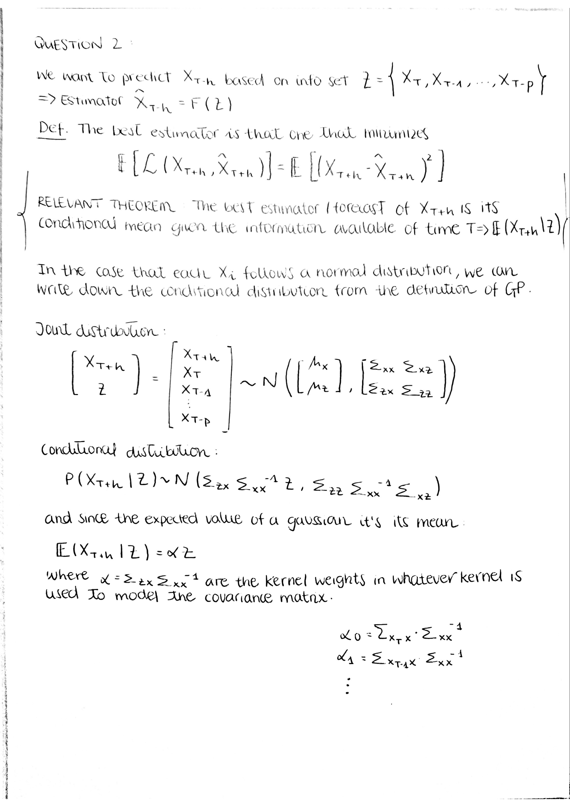

```{r include = FALSE, warning = FALSE}
library(imputeTS)
library(dplyr)
library(xts)
library(vars)
library(quantmod)
library(TTR)
library(lmtest)
library(reshape2)
library(ggplot2)
require(reshape2)
library(ggpubr)
library(knitr)
library(kableExtra)
library(patchwork)
library(MASS)
library(glmnet)
library(caret)
library(kernlab)
library(tidyverse)
#library("MSBVAR")

```

## Question 1

### Part 1 - Theoretical Proof


### Part 2 - Hands-on Application

```{r, echo=FALSE}
fileloc <- dirname(rstudioapi::getSourceEditorContext()$path)
setwd(fileloc)
rm(fileloc)
#Load data
WorldMarkts99_20 <- readRDS("./Homework 1/Data/WorldMarkts99_20.RDS")
markets <- ls(WorldMarkts99_20)
```

```{r, echo=FALSE, warning=FALSE}
### Now we create a function to return and impute the missing values in the daily series using interpolation
#retrieve_returns: Retrieve returns for a list of markets given a specified time period
#Variables -> period: ‘daily’, ‘weekly’, ‘monthly’, ‘quarterly’, ‘yearly’
#             type: arithmetic (discrete) or log (continuous)

retrieve_returns <- function(sampling_per,type_c) {
  returns <- xts() #empty time series object
  for (i in seq_along(markets)){
    sym <- markets[i]
    daily_na <- na_interpolation(Ad(get(sym,envir = WorldMarkts99_20)),'linear')
    returns <- merge(returns,periodReturn(daily_na,period = sampling_per,type =type_c))
  }
  names(returns)<-markets
  return(returns)
}

#### 2001/07-2003/06
method<-'log'
period<-'200107/200306'

daily_returns <- retrieve_returns('daily',method)
daily_returns <-daily_returns[period]
## Due to data constrution we me use LOCF missing data imputation
daily_returns<-na_locf(daily_returns,option = 'locf')


```

A comparison between the arithmetic MA volatility and the EWMA volatility can be seen in the following image for the IBEX index during the 07/2001 - 06/2003 time period. $\lambda$ was set to 0.94 for the EWMA. The results were computed for a 5 days rolling window.

```{r, echo=FALSE, warning=FALSE, fig.height= 7 , fig.width= 14}
##Do the same analysis for volatilities series of each market
## Enough to consider the variance as  EMA of square returns
## Do the analysis for week and month sampling periods
## Optional: Apply  rolling windows with first year of data and step forward one period (week or month)

IBEX <-daily_returns$IBEX^2
arith_MA <- SMA(IBEX, n = 5)
ewma <- EMA(IBEX, n = 5, ratio = 0.06)

par(mfrow = c(1, 2))# space for one row of text at ticks and to separate plots
plot(arith_MA)
plot(ewma)

```

Notice how the plot on the right (EWMA volatility) presents a smoother behavior than its counterpart (simple MA). This makes sense considering that in EWMA, past observations' contribution decay in a well behaved manner, whereas MA simply drops the past observation that falls outside the rolling window, causing more pronounced jumps in the resulting series. 

## Question 2



## Question 3

The dataset WorldMarkts99 20.RDS contains price history from 1999/01/01 to 2020/04/30 of 11 market indices worldwide plus VLIC and VIX. The objective of this exercise is to analyze the relationship between the returns and the volatility of this indices as it has been frequently observed that US markets leads other developed markets in Europe or Asia, and that at times the leader becomes the follower. In other words, it has been observed that the return of some indices behave like other asset´s returns of completely the opposite. To do so we will conduct a casual analysis utilizing granger causality in a specific time frame (from 07-2001 to 06-2003)

To initialize the analysis we must note that the series contains missing data as it can be observed in the plot below.

```{r echo = FALSE, warning = FALSE, fig.height= 7 , fig.width= 14}

prices <- xts()
for (i in seq_along(markets)){
  sym <- markets[i]
  prices <- merge(prices,Ad(get(sym,envir = WorldMarkts99_20)))
}
period<-'200107/200306'
prices <- prices[period]
prices_df <- data.frame(prices) %>%
  mutate(date_price=index(prices))
prices_longform <- melt(prices_df,id.vars = "date_price")

ggplot(prices_longform, aes(x=date_price)) + 
  geom_line(aes(y=value, col=variable)) + 
  labs(title="Time Series of Market Indexes", 
       subtitle="From 2001-07 to 2003-06", 
       caption="Source: Yahoo Finance", 
       y="Index price",
       x='date', 
       color=NULL) +  # change to monthly ticks and labels
  theme(axis.text.x = element_text(angle = 90, vjust=0.5, size = 8),  # rotate x axis text
        panel.grid.minor = element_blank())
```

The first step in our analysis in to impute the missing data in the daily prices series. To do so we will employ the 'ImputeTS' library, a library specialized in time series imputation. As we are trying to impute data points between known data points in a series we will utilize the interpolation method of imputation. For this specific case we will use linear interpolation which is achieved by geometrically rendering a straight line between two adjacent points on a graph or plane. Having this values imputed in the daily series we can now calculate the monthly and weekly logarithmic returns of the series.

After having calculated the periodic returns of the series we can initialize the causality analysis. To do so we use the granger.test function from the 'MSBVAR' library. The table below shows the causality analysis for the first four lags of the returns of these indices, note that the cause -\> effect analysis goes from row to column. The binary variable corresponds to causality, that is 1 if X causes Y (p-value is less than 0.05) and 0 otherwise.

```{r echo = FALSE, warning = FALSE}
### In this code we create the function granger.test (modified from original function in package MSVAR)
##Granger Test function
## If the p-value is less than 0.05, one rejects the null hypothesis, and hence X causes Y .
granger.test <- function(y, p)
  { m <- ncol(y)

    # Check that we have enough variables to sensibly do this.
    if(m<2)
      { stop(paste("Error: granger.test needs at least 2 variables"))
      }

    # Make objects to hold the results and names
    results <- matrix(list(0),ncol(y),ncol(y))
    varnames <- dimnames(y)[[2]]
    colnames(results)<-varnames
    rownames(results)<-varnames
    
    for (l in p){
    for(i in 1:m)
      { for (j in 1:m)
          {
            if(i==j) { next }
            Y <- embed(cbind(y[,i], y[,j]), l+1)
            X1 <- Y[, -(1:2)]
            X2 <- X1[, ((1:l)*2) - (1 %% 2)]
            restricted <- lm(Y[,1] ~ X2)
            unrestricted <- lm(Y[,1] ~ X1)
            
            ssqR <- sum(restricted$resid^2)
            ssqU <- sum(unrestricted$resid^2)

            ftest <- ((ssqR - ssqU)/l)/(ssqU/(nrow(Y) - 2*l - 1))

            # Save the results

            endog.name <- varnames[i] #esto es y
            exog.name <- varnames[j] # esto es x
            pvalue<- 1 - pf(ftest, l, nrow(Y) - 2 * l - 1)
            if(pvalue < 0.05){
              causal = 1
            }else{
              causal = 0}
            results[exog.name,endog.name][[1]][l]<-causal
            
          }}
      }
    return(results)
}

#Compute weekly and monthly returns
method<-'log'
period<-'200107/200306'

weekly_returns <- retrieve_returns('weekly',method)
weekly_returns <-weekly_returns[period]

monthly_returns <-retrieve_returns('monthly',method)
monthly_returns <- monthly_returns[period]

## Due to data constrution we me use LOCF missing data imputation

weekly_returns<-na_locf(weekly_returns,option = 'locf')
monthly_returns <- na_locf(monthly_returns,option = 'locf')


h = c(1,2,3,4)
monthly_causality<-granger.test(monthly_returns,h)
weekly_causality <-granger.test(weekly_returns,h)

### We repeat the process described before for the volatilities
volatilities_idx <- markets
get_vols <- function(period) {
  
  if(period == 'weekly'){
    vols = xts()
    for(i in seq_along(volatilities_idx)){
      sym<-volatilities_idx[i]
      daily <- na_interpolation(get(sym,envir = WorldMarkts99_20),'linear')
      weekly<- apply.weekly(daily,mean)
      vols<-merge(vols,EMA(Ad(weekly),n=1,ratio = 1-0.94))
    }
    
    colnames(vols)<-volatilities_idx
    return(vols)
    
  } else if(period =='monthly'){
    vols = xts()
    for(i in seq_along(volatilities_idx)){
  sym<-volatilities_idx[i]
  daily <- na_interpolation(get(sym,envir = WorldMarkts99_20),'linear')
  monthly<- apply.monthly(daily,mean)
  vols<- merge(vols,EMA(Ad(monthly),n=1,ratio = 1-0.94))
    }
    
    colnames(vols)<-volatilities_idx
    return(vols)
  }
}
weekly_vol<-get_vols('weekly')
weekly_vol<-weekly_vol[period]

monthly_vol<-get_vols('monthly')
monthly_vol<-monthly_vol[period]

monthly_volcausality<-granger.test(monthly_vol,h)
weekly_volcausality <-granger.test(weekly_vol,h)

item = c()
for (i in 1:length(monthly_causality)){
  monthly_causality[i][[1]] <- append(item,paste(monthly_causality[i][[1]],collapse = ', '))
}
monthly_causality <- data.frame(monthly_causality)

knitr::kable(monthly_causality,booktabs = TRUE,caption = 'Monthly Causality of the Returns') %>% 
  kable_styling(bootstrap_options = c("striped", "hover", "condensed", "responsive"), font_size = 10,html_font = "Times New Roman") %>%
  column_spec(1, bold = T, border_right = T) %>%
  row_spec(1, extra_css = "border-upper: 1px solid")
```

```{r echo = FALSE, warning = FALSE}
item = c()
for (i in 1:length(weekly_causality)){
  weekly_causality[i][[1]] <- append(item,paste(weekly_causality[i][[1]],collapse = ', '))
}
weekly_causality <- data.frame(weekly_causality)

knitr::kable(weekly_causality,booktabs = TRUE,caption = 'Weekly Causality of the Returns') %>% 
  kable_styling(bootstrap_options = c("striped", "hover", "condensed", "responsive"), font_size = 10,html_font = "Times New Roman") %>%
  column_spec(1, bold = T, border_right = T) %>%
  row_spec(1, extra_css = "border-upper: 1px solid")
```

What we see in the causality of the returns that the majority of the return of the indices are not caused by other indices. However in the case of the JKSE (Jakarta Composite Index) we observe that its monthly returns are caused by the returns of the indices of other economies. This is also an observable behavior in the HSCE (Hang Seng China Enterprises Index) where its monthly returns in larger lags can be explained by other indices. In an economic sense, this is a logical behavior where we see leader economies and followers, in this case we would consider both the JKSE and the HSCE followers of indices in stronger economies and do not follow each other as it can be see in the causality of one another. This leader-follower behaviour is more evident in weekly returns, hence in a short term

```{r echo = FALSE, warning = FALSE}
item = c()
for (i in 1:length(monthly_volcausality)){
  monthly_volcausality[i][[1]] <- append(item,paste(monthly_volcausality[i][[1]],collapse = ', '))
}
monthly_volcausality <- data.frame(monthly_volcausality)

knitr::kable(monthly_volcausality,booktabs = TRUE,caption = 'Monthly Causality of the Volatilities') %>% 
  kable_styling(bootstrap_options = c("striped", "hover", "condensed", "responsive"), font_size = 10,html_font = "Times New Roman") %>%
  column_spec(1, bold = T, border_right = T) %>%
  row_spec(1, extra_css = "border-upper: 1px solid")
```

```{r echo = FALSE, warning = FALSE}
item = c()
for (i in 1:length(weekly_volcausality)){
  weekly_volcausality[i][[1]] <- append(item,paste(weekly_volcausality[i][[1]],collapse = ', '))
}
weekly_volcausality <- data.frame(weekly_volcausality)

knitr::kable(weekly_volcausality,booktabs = TRUE,caption = 'Weekly Causality of the Volatilities') %>% 
  kable_styling(bootstrap_options = c("striped", "hover", "condensed", "responsive"), font_size = 10,html_font = "Times New Roman") %>%
  column_spec(1, bold = T, border_right = T) %>%
  row_spec(1, extra_css = "border-upper: 1px solid")
```

Regarding volatility spill over, here we see the transmission of instability from market to market. Its is very clear from the causality results that markets are truly interconnected therefore in both short and medium term the instability from one market is transmitted to others.

## Question 4

For this exercise we sampled 5 different functions for 200 point between -10 and 10 from a latent Gaussian process prior:

$$
f \sim \mathcal{N}(0,K)
$$

where K is the covariance matrix. We will sample these five functions using the 4 kernels with various parameters.

### Squared Exponential Kernel

$$k_{se}(\mathbf{x,x'}) = h^2 (\frac{\mathbf{(x,x')}^2}{\lambda^2}) \text{for} \quad h=1; \lambda = 0.1,1,10
$$

The functions are plotted below. The hyper parameter $\lambda$ describes the variance which determines the average distance of the data-generating function from its mean. Hence the smaller the value the higher the larger distance from its mean and large $\lambda$ value create smoother functions. For smaller values of $\lambda$, if x is close to y, this means that x and y are highly correlated (and so the kernel function returns a large value). Because the kernel in this context is the covariance of the GP, we see higher variability in our simulations for lower values of $\lambda$. The correlations (tails of the gaussian) also decay quicker for a smaller $\lambda$. For large values of lambda the similarity measure consider values that are ‘close’ and ‘far away’ as not much different. This means that for low values of lambda we get a rich class of distributions, while large values of lambda provide a much narrower class of distributions.

```{r echo= FALSE, warning=FALSE,fig.height= 8 , fig.width= 14}
SE <- function(a,b,l) {
  se <- -sum((a-b)^2)
  return(exp(se/l^2))
}

RQ <- function(a,b,l,alpha) {
  se <- sum((a-b)^2)
  fraction <-1+(se/(alpha*l^2))
  return(fraction^(-alpha))
}

K3 <- function(a,b,l) {
   suma <- -sum((sin(pi*(a-b)/3))^2)
   fraction <- suma/(2*l^2)
   return(2*exp(fraction))
}

K4 <- function(a,b,l){
  k <- -sum((a-b)^2)
  frac_exp<- 2*exp(k/(2*l^2))
  mult<- 1.5*sum((a*b))
  return(frac_exp+mult)
}

calcSigma_4 <- function(X1,X2,l, kernel,alp=1) {
  Sigma <- matrix(rep(0, length(X1)*length(X2)), nrow=length(X1))
  for (i in 1:nrow(Sigma)) {
    for (j in 1:ncol(Sigma)) {
      if (kernel =='SE'){
      Sigma[i,j] <- SE(X1[i],X2[j],l=l)}
      else if (kernel == 'RQ'){
      Sigma[i,j] <- RQ(X1[i],X2[j],l=l,alpha=alp)
      } else if (kernel =='K3'){
      Sigma[i,j] <- K3(X1[i],X2[j],l=l)
      } else if (kernel == 'K4'){
      Sigma[i,j] <- K4(X1[i],X2[j],l=l)
      }
    }
  }
  return(Sigma)
}

x.star <- seq(-10,10,len=200)
n.samples <- 5

kernels = c('SE','RQ','K3','K4')
SE_RQ = c(0.1,1,10)
K3_K4 =c(0.1,1.5,5)
alpha = c(1,5,10)

for (ker in kernels){
  if (ker == 'SE'){
    plot_list = c()
    plot_num = 0
    for (par in SE_RQ){
      sigma = calcSigma_4(x.star,x.star,l = par,kernel = ker)
      functions <- matrix(rep(0,length(x.star)*n.samples), ncol=n.samples)
      for (i in 1:n.samples) {
        # Each column represents a sample from a multivariate normal distribution
        # with zero mean and covariance sigma
        functions[,i] <- mvrnorm(1, rep(0, length(x.star)), sigma)
      }

      functions <- cbind(x=x.star,as.data.frame(functions))
      functions <- melt(functions,id="x")

    # Plot the result
      plot_num =  plot_num+1
      plot <- paste('plot',plot_num,sep = '')
      plot_list <- append(plot_list,plot)
      
      fig2a <- ggplot(functions,aes(x=x,y=value)) +
      geom_rect(xmin=-Inf, xmax=Inf, ymin=-2, ymax=2, fill="grey80") +
      #geom_line(aes(group=variable),colour="blue") +
      geom_line(aes(group=variable,colour=variable)) +
      theme_bw() +
      scale_y_continuous(lim=c(-4,4), name="output, f(x)") +
      xlab("input, x") + ggtitle(paste('lambda=',par))
      assign(plot,fig2a)
    }
    SEplot <- plot1 / plot2 / plot3 
    
  }
    if (ker == 'RQ'){
    plot_list = c()
    plot_num = 0
    for (par in SE_RQ){
      for(al in alpha){
      sigma = calcSigma_4(x.star,x.star,l = par,kernel = ker,alp=al)
      functions <- matrix(rep(0,length(x.star)*n.samples), ncol=n.samples)
      for (i in 1:n.samples) {
        # Each column represents a sample from a multivariate normal distribution
        # with zero mean and covariance sigma
        functions[,i] <- mvrnorm(1, rep(0, length(x.star)), sigma)
      }

      functions <- cbind(x=x.star,as.data.frame(functions))
      functions <- melt(functions,id="x")

    # Plot the result
      plot_num =  plot_num+1
      plot <- paste('plot',plot_num,sep = '')
      plot_list <- append(plot_list,plot)

      
      fig2a <- ggplot(functions,aes(x=x,y=value)) +
      geom_rect(xmin=-Inf, xmax=Inf, ymin=-2, ymax=2, fill="grey80") +
      #geom_line(aes(group=variable),colour="blue") +
      geom_line(aes(group=variable,colour=variable)) +
      theme_bw() +
      scale_y_continuous(lim=c(-4,4), name="output, f(x)") +
      xlab("input, x") + ggtitle(paste('lambda=',par,'and alpha =',al))
      assign(plot,fig2a)

      }
    }
    
  RQ_1plot <- plot1 / plot4 / plot7
  RQ_2plot <- plot2 / plot5 / plot8
  RQ_3plot <- plot3 / plot6 / plot9
  
    }
  
      if (ker == 'K3'){
    plot_list = c()
    plot_num = 0
    for (par in K3_K4){
      
      sigma = calcSigma_4(x.star,x.star,l = par,kernel = ker)
      functions <- matrix(rep(0,length(x.star)*n.samples), ncol=n.samples)
      for (i in 1:n.samples) {
        # Each column represents a sample from a multivariate normal distribution
        # with zero mean and covariance sigma
        functions[,i] <- mvrnorm(1, rep(0, length(x.star)), sigma)
      }

      functions <- cbind(x=x.star,as.data.frame(functions))
      functions <- melt(functions,id="x")
      

      plot_num =  plot_num+1
      plot <- paste('plot',plot_num,sep = '')
      plot_list <- append(plot_list,plot)
      
      fig2a <- ggplot(functions,aes(x=x,y=value)) +
      geom_rect(xmin=-Inf, xmax=Inf, ymin=-2, ymax=2, fill="grey80") +
      #geom_line(aes(group=variable),colour="blue") +
      geom_line(aes(group=variable,colour=variable)) +
      theme_bw() +
      scale_y_continuous(lim=c(-4,4), name="output, f(x)") +
      xlab("input, x")+ ggtitle(paste('lambda=',par))
      assign(plot,fig2a)
    
    }
    
    K3plot <- plot1/plot2/plot3
    

      }
  
        if (ker == 'K4'){
    plot_list = c()
    plot_num = 0
    for (par in K3_K4){
      
      sigma = calcSigma_4(x.star,x.star,l = par,kernel = ker)
      functions <- matrix(rep(0,length(x.star)*n.samples), ncol=n.samples)
      for (i in 1:n.samples) {
        # Each column represents a sample from a multivariate normal distribution
        # with zero mean and covariance sigma
        functions[,i] <- mvrnorm(1, rep(0, length(x.star)), sigma)
      }

      functions <- cbind(x=x.star,as.data.frame(functions))
      functions <- melt(functions,id="x")
      
      plot_num =  plot_num+1
      plot <- paste('plot',plot_num,sep = '')
      plot_list <- append(plot_list,plot)

      fig2a <- ggplot(functions,aes(x=x,y=value)) +
      geom_rect(xmin=-Inf, xmax=Inf, ymin=-10, ymax=10, fill="grey80") +
      #geom_line(aes(group=variable),colour="blue") +
      geom_line(aes(group=variable,colour=variable)) +
      theme_bw() +
      scale_y_continuous(lim=c(-20,20), name="output, f(x)") +
      xlab("input, x") + ggtitle(paste('lambda=',par))
      assign(plot,fig2a)
    
    }
  
  K4plot <- plot1/plot2/plot3

        }
}

SEplot+ plot_annotation(
  title = 'Squared Exponential Kernel Plot',
  subtitle = 'Lambda = 0.1, 1 and 10'
) &  theme(axis.text.x = element_text(angle = 90, vjust=0.5, size = 8),  # rotate x axis text
        panel.grid.minor = element_blank())
```

### Rational Quadratic Kernel

$$k_{rq}(\mathbf{x,x'}) = h^2(1+\frac{(\mathbf{x-x'})^2}{\alpha \lambda^2})^{-\alpha} \quad \text{for,}\quad h=1; \lambda = 0.1,1,10; \alpha = 1,5,10$$

This kernel is equivalent to summing over infinitely many squared exponential kernels. Hence, GP priors with this kernel are expected to see functions which vary smoothly across many length scales. When we compare the plots for $\alpha$ = 1 we see that variability of the data is higher than the comparable plots in the squared exponential kernel. The behavior of $\lambda$ is very similar to the squared exponential kernel, however as it multiplied by $\alpha$ we expect to see and exageration in this behavior.

The change in the variability introduced by $\lambda$ in the kernel is maximized by the hyper parameter $\alpha$. Hence for larger values of $\alpha$ there is an obvious increase in the distance of the points from its mean for small values of $\lambda$.

```{r echo= FALSE, warning=FALSE, fig.height= 8 , fig.width= 14}
RQ_1plot+ plot_annotation(
  title = 'Rational Quadratic Kernel Plot',
  subtitle = 'Lambda = 0.1, 1 and 10 with fixed alpha = 1'
) &  theme(axis.text.x = element_text(angle = 90, vjust=0.5, size = 8),  # rotate x axis text
        panel.grid.minor = element_blank())

```

```{r echo= FALSE, warning=FALSE, fig.height= 8 , fig.width= 14}
RQ_2plot+ plot_annotation(
  title = 'Rational Quadratic Kernel Plot',
  subtitle = 'Lambda = 0.1, 1 and 10 wit fixed alpha = 5'
) &  theme(axis.text.x = element_text(angle = 90, vjust=0.5, size = 8),  # rotate x axis text
        panel.grid.minor = element_blank())
```

```{r echo= FALSE, warning=FALSE, fig.height= 8 , fig.width= 14}
RQ_3plot+ plot_annotation(
  title = 'Rational Quadratic Kernel Plot',
  subtitle = 'Lambda = 0.1, 1 and 10 with alpha = 10'
) &  theme(axis.text.x = element_text(angle = 90, vjust=0.5, size = 8),  # rotate x axis text
        panel.grid.minor = element_blank())
```

### **Periodic Kernel**

$$
k_{3}(\mathbf{x,x'}) = 2exp(\frac{-sin(\pi(\mathbf{x-x'})/3)^2}{2 \lambda^2})+1.5\mathbf{xx'}, \quad \text{for} \quad h= 1,\lambda = 0.1,1,10
$$

Once again the hyperparameter $\lambda$ introduces the variability of the series. The lower the value the more distance and rate of change in the values we see in our function. However, interestingly in this kernel we see that for smoother function there is a periodic pattern repeated, this pattern is very clear for $\lambda = 10$. This pattern is introduced by the sin function. The distance between repetitions is in this specific case 3

```{r echo= FALSE, warning=FALSE, fig.height= 8 , fig.width= 14}
K3plot+ plot_annotation(
  title = 'Thrid Kernel Plot',
  subtitle = 'Lambda = 0.1, 1 and 10'
) &  theme(axis.text.x = element_text(angle = 90, vjust=0.5, size = 8),  # rotate x axis text
        panel.grid.minor = element_blank())
```

### Fourth Kernel

$$
k_{4}(\mathbf{x,x'}) = 2exp(\frac{\mathbf{x-x'}^2}{2 \lambda^2})+1.5\mathbf{xx'}, \quad \text{for} \quad h= 1,\lambda = 0.1,1,10
$$

This fourth kernel is a combination of a periodic kernel and a linear. While the periodic kernel is responsible for the distance of the points form its mean, the linear kernel is responsible for the trend of the function, hence this is not a stationary kernel. However we see a very similar pattern in the hyperparameter $\lambda$

```{r echo= FALSE, warning=FALSE, fig.height= 8 , fig.width= 14}
K4plot+ plot_annotation(
  title = 'Fourht Kernel Plot',
  subtitle = 'Lambda = 0.1, 1 and 10'
) &  theme(axis.text.x = element_text(angle = 90, vjust=0.5, size = 8),  # rotate x axis text
        panel.grid.minor = element_blank())
```

## Question 5

In the following plot we show the Time series we aim to predict via GP. In order to do so, we will use the divident-payout ratio (de), dividend yield (dy), their respective laga, and the lags of the timeseries itself. Notice that the features are transformed to have the same form as the time series they aim to predict. For example, the features for the log return time series should be the log de and the log dy. 

```{r echo= FALSE, fig.height= 7 , fig.width= 15}
# Import variables, transform predicted variable
sp500 = as.xts(read.zoo('./Homework 1/Data/GoyalMonthly2005.csv',sep=',',header=TRUE, format='%Y-%m-%d'))
mt=sp500['1927/2005']

## price of SP500
price = mt$Index
names(price) = "price"
## log returns of SP500 (logret)
logret =diff(log(mt$Index))
names(logret) = "logret"
## Trend of SP500
trend = SMA(mt$Index, n = 5)
names(trend) = "trend"

##Predictor (wanna-be) variables
# dividend-payout ratio (de)
de <- mt$D12/mt$E12
logde <- diff(log(de))
names(de) = "de"; names(logde) = "logde"
## dividend yield 
dy <- mt$D12/stats::lag(mt$Index,1)
logdy <- diff(log(dy))
names(dy) = "dy"; names(logdy) = "logdy";   

#Target + Features: lags 0,1,2,3 of de and dy and lags 1,2,3 of logreturn
Z_ret = as.data.frame(merge(logret,na.trim(stats::lag(logret,1)),na.trim(stats::lag(logret,2)),na.trim(stats::lag(logret,3)),
                            logde, na.trim(stats::lag(logde,1)),na.trim(stats::lag(logde,2)),na.trim(stats::lag(logde,3)),
                            logdy, na.trim(stats::lag(logdy,1)),na.trim(stats::lag(logdy,2)),na.trim(stats::lag(logdy,3)),all=FALSE))

Z_pri = as.data.frame(merge(price,na.trim(stats::lag(price,1)),na.trim(stats::lag(price,2)),na.trim(stats::lag(price,3)),
                            de, na.trim(stats::lag(de,1)),na.trim(stats::lag(de,2)),na.trim(stats::lag(de,3)),
                            dy, na.trim(stats::lag(dy,1)),na.trim(stats::lag(dy,2)),na.trim(stats::lag(dy,3)),all=FALSE))

par(mfrow = c(1, 3))# space for one row of text at ticks and to separate plots
plot(logret, type="l",col="black")
plot(price,  type="l",col="black")
plot(trend,  type="l",col="black")
```


```{r, echo=FALSE, fig.height= 7 , fig.width= 15}
df <- Z_ret %>% dplyr::select(c(logret, logde,logdy))
df <- cbind(date = rownames(df), df)
df <- melt(df , id.vars = 'date', variable.name = 'series')

df2 <- Z_pri %>% dplyr::select(c(price, de, dy))
df2 <- cbind(date = rownames(df2), df2)
df2 <- melt(df2 , id.vars = 'date', variable.name = 'series')

# plot
log_graph <- ggplot(df, aes(date,value, group = 1)) + geom_line(aes(colour = series))
pri_graph <- ggplot(df2, aes(date,value, group = 1)) + geom_line(aes(colour = series))

ggarrange(log_graph, pri_graph, 
          labels = c("Log Return + Features", "Price + Features"),
          ncol = 1, nrow = 2)

```

Next, we fit LASSO in order to do feature selection. The proper hyperparameter for the LASSO regression is set via AIC criterion. 

```{r echo= FALSE}
# LASSO for variable selection via AIC criterion

#Define function that will perform LASSO AIC
lasso.aic <- function(y,x) {
  #Select model in LASSO path with best AIC (using LASSO regression estimates)
  #Input
  # - y: vector with response variable
  # - x: design matrix
  #
  #Output: list with the following elements
  # - coef: LASSO-estimated regression coefficient with lambda set via AIC
  # - ypred: predicted y
  # - lambda.opt: optimal value of lambda
  # - lambda: data.frame with aic and number of selected variables for each value of lambda
  require(glmnet)
  fit <- glmnet(x=x,y=y,family='gaussian',alpha=1)
  pred <- cbind(1,x) %*% rbind(fit$a0,fit$beta)
  n <- length(y)
  p <- colSums(fit$beta!=0) + 1
  aic <- n * log(colSums((y-pred)^2)/length(y)) + n*(log(2*pi)+1) + 2*p 
  sel <- which.min(aic)
  beta <- c(fit$a0[sel],fit$beta[,sel]); names(beta)[1]= 'Intercept'
  ypred <- pred[,sel]
  ans <- list(coef=beta,ypred=ypred,lambda.opt=fit$lambda[sel],lambda=data.frame(lambda=fit$lambda,aic=aic,nvars=p))
  return(ans)
}

#Target and variables
logreturn <- Z_ret$logret
log_variables <-  model.matrix(~ logret.1 + logret.2 + logret.3 + logde + logde.1 + logde.2 + logde.3 + logdy + logdy.1 + logdy.2 + logdy.3,
                               Z_ret %>% dplyr::select(-c(logret)))[,-1]

pri <- Z_pri$price
pri_variables <-  model.matrix(~ price.1 + price.2 + price.3 + de + de.1 + de.2 + de.3 + dy + dy.1 + dy.2 + dy.3,
                               Z_pri %>% dplyr::select(-c(price)))[,-1]


#Fit and do variable selection
res <- lasso.aic(logreturn,log_variables) # The coefficients to use chosen by AIC are logdy.2, logret.1.
res_pri <- lasso.aic(pri,pri_variables) # The coefficients to use chosen by AIC are price.1, price.2, and price.3.

```

According to AIC, the features selected in order to predict the log returns are: log dy with lag 2, and log returns with lag 1
For the price, though, the features selected are: price with lag 1, price with lag 2, price with lag 3.


```{r echo = FALSE, results = FALSE}
### Forecasting with GP

###EVALUATION Functs
##1. Evaluation for TARGET prediction.  
##sum of squares errors function
ssr <-function(actual,pred){
  sum((actual - pred)^2)
}
##Normalize Residual Mean Square Error (NRMSE) funct
nrmse <- function(actual,pred){
  sqrt(ssr(actual,pred)/((length(actual)-1)*var(actual)))
} 
##percentage of outperforming direct sample mean (sample expected value)
pcorrect<- function(actual,pred){
  (1-nrmse(actual,pred))*100
}

##frequency of sampling
tau=1 #data is monthly. Try tau=12 (year), tau=3 (quarterly)

##Model Inputs:
##Define matrix of features (each column is a feature)

# Restricted model
model_restricted <- paste0("logret ~ logret.1 + logdy.2 ")
res_logreturn <- logret
res_log_variables <-  model.matrix(~ logret.1 +  logdy.2 ,
                           Z_ret %>% dplyr::select(-c(logret)))[,-1]
##add TARGET. We want to predict RETURN
dataset = merge(res_logreturn, res_log_variables,all=FALSE)
colnames(dataset) = c("TARGET","logret.1", "logdy.2")

# Price Restricted model
model_restricted_price <- paste0("price ~ price.1 + price.2 + price.3 ")
res_price <- price
res_price_variables <-  model.matrix(~ price.1 + price.2 +  price.3 ,
                           Z_pri %>% dplyr::select(-c(price)))[,-1]
##add TARGET. We want to predict RETURN
dataset_price = merge(res_price, res_price_variables,all=FALSE)
colnames(dataset_price) = c("TARGET","price.1", "price.2", "price.3")
```

Up next, we split the data into train (75%) and test (25%), and we will look for the best kernel. That is, the kernel that provides the best predictions on our testing data.
For the log returns, we will chose out of the stationary kernels: "rbfdot","laplacedot","besseldot","polydot".
Meanwhile, for the price, given that it's clearly not stationary, we will be fitting a "vanilladot" and a "tanhdot".

```{r echo = FALSE}
##Divide data into training (75%) and testing (25%). 
T<-nrow(dataset)
p=0.75
T_trn <- round(p*T)
trainindex <- 1:T_trn
##process class sets as data frames
training = as.data.frame(dataset[trainindex,])
rownames(training) = NULL
testing = as.data.frame(dataset[-trainindex,])
rownames(testing) = NULL
train_test_data = list(training,testing)

##Same for Price data. 
T_price<-nrow(dataset_price)
p=0.75
T_trn_price <- round(p*T_price)
trainindex_price <- 1:T_trn_price
##process class sets as data frames
training_price = as.data.frame(dataset_price[trainindex_price,])
rownames(training_price) = NULL
testing_price = as.data.frame(dataset_price[-trainindex_price,])
rownames(testing_price) = NULL
train_test_data_price = list(training_price,testing_price)

```

```{r echo=FALSE, results = FALSE}
#Function to train the model
kernel.GP <- function(train,test,kernel_type){
  ssr <- matrix(NA, length(kernel_type))
  for(i in 1:length(kernel_type)){
    gpfit = gausspr(x=train[,-1], y=train[,1],
                    type="regression",
                    kernel=kernel_type[i],
                    #kpar = list(sigma = 1.5), #list of kernel hyper-parameters 
                    ## if you make it constant value then does not make mle estimation of sigma
                    var = 0.002 # the initial noise variance: 0.001 default
    )
    predGP<-predict(gpfit, test[,-1])
    ssr[i] <- sum((test[,1] - predGP)^2)
  }
  index <- which(ssr == min(ssr), arr.ind = TRUE)
  return(list(kernel_type[index],ssr[index]))
}

#For the log return, we will try to look for the best stationary kernel
kernel_type <- c("rbfdot","laplacedot","besseldot","polydot")
##parameter kernel for logreturn GP
best_kern <- kernel.GP(train=training,test=testing,kernel_type=kernel_type)[1]
best_ssr <- kernel.GP(train=training,test=testing,kernel_type=kernel_type)[2]


##For Price, let's try the non-stationary: vanilladot and the tanhdot kernels
gpfit_tanh <- gausspr(x=training_price[,-1], y=training_price[,1],
                type="regression",
                kernel="tanhdot",
                kpar = "automatic", #list of kernel hyper-parameters 
                ## if you make it constant value then does not make mle estimation of sigma
                var = 0.002 # the initial noise variance: 0.001 default
)

predGP_tanh<-predict(gpfit_tanh, testing_price[,-1])
ssr_tanh <- sum((testing_price[,1] - predGP_tanh)^2)

```

According to the combinations of kernels and hyperparameters we have tried, the one that seems to give the best performance is the "besseldot". Specifically, it seems to perform well on the log returns predictions. Which makes sense considering that is stationary. The ssr yield by "besseldot" is 0.143, while the ones we have tried on the Price data yielded much bigger srr. The hyperparameters chosen for the Bessel kernel are sigma=1.5, order=1 and degree=1.


```{r echo=FALSE, results = FALSE}
gpfit = gausspr(TARGET~., data=training,
                type="regression",
                kernel= "besseldot",
                var = 0.002 # the initial noise variance: 0.001 default min value
)
gpfit
##build predictor (predict on test data)
GPpredict <- predict(gpfit,testing)
```


```{r echo=FALSE}
### Evaluation of Results
actualTS=testing[,ncol(testing)] ##the true series to predict
predicTS = GPpredict

##Check the gap between training error (mse) and testing error
train.error <- error(gpfit)  
testing.error <- mean((actualTS - predicTS)^2)
gap <- abs(testing.error - train.error) ; 
print(paste("gap between training and testing error: ",round(gap,3)))
```


## Question 6


